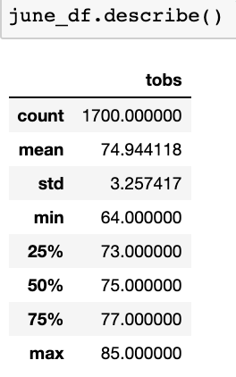
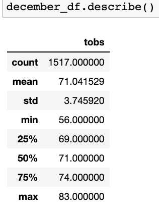
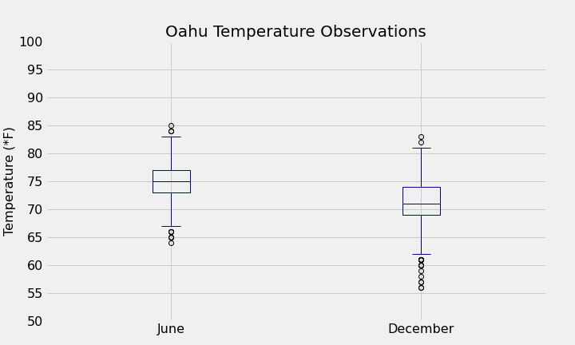

# surfs_up

Performing climate analysis using python and SQLite to store, retrieve and analyze data, and Flask for data visualization. 

## Overview
The purpose of this project is to perform a climate analysis for the Hawaiian island of Oahu to help W. Avy determine whether this would be suitable location to open up a surf and shake shack, offering surfing equipment and ice cream. 

For this analysis, we will use a SQLite database containing data from multiple weather stations on the island of Oahu. In particular, we will assess the months of June and December to better understand seasonal temperature differences. Additionally, we will build a Flask app to help W.Avy present this data to potential investors. 

## Results

### *June Temperature Observations*

* The average temperature of Oahu in June is 74.9&deg;F. This remains consistent from year to year with a standard devation of only +/- 3.2&deg;F. 

* The maxium recorded temperature is 85.0&deg;F, while the minimum recorded temperature is 64.0&deg;F.

### *December Temperature Observations*

* The average temperature of Oahu in December is 71.0&deg;F. This also remains consistent from year to year with a standard deviation of only +/- 3.7&deg;F.

* The maximum recorded temperature is 83.0&deg;F, while the minimum recorded temperature is 56.0&deg;F.

### *Summary

The box plot above is a visual representation of the temperature statistics for the months of June and December. As far as seasonal differences go, we can see that the temperature on Oahu remains consistent at a comfortable range of 65&deg;F to 85&deg;F year-round. Based on temperature, Oahu would be an ideal location to open up a surf and shake shack.

One additional piece of weather information that would be useful is how much rainfall the island gets year round. We could perform a query to get overall rainfall for the months of June and December. We could then query rainfall recorded at the different weather stations across the island and sort from low to high to identify locations that would be more ideal for the shake shack. 